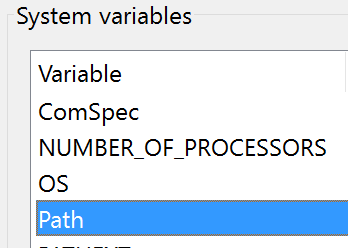

### Setting up a windows python environment that *Just works*

This hasn't been the easiest thing to do in the past, but the latest versions of python have made things easy!
For simplicity and portability, let's just get Python2.x

Follow these steps (Don't skip anything!):

1. Got to https://www.python.org/downloads/windows/
2. Select `Latest Python 2 Release - Python 2.x.xx` (Whatever the latest version is)
3. Download `Windows x86-64 MSI installer`
4. Click through the installation
5. You now have python! Let's make it easily accessible!
6. Open control panel
7. In the search bar on the top right, search for `edit the system environment variables`
8. Select `edit the system environment variables` that comes up in the results
9. In the dialog that opens, there will be a button called `Environment Variables...`. Click it!
10. You should see 2 boxes `User variables for ..` and `System variables`
11. Under `System variables` look for a row that reads `Path`
    
12. Select `Path`, then click edit on the bottom
13. You should now see a new dialog with a list of folders and options on the right
14. Click `New`, then enter `C:\Python27`
15. Next, click `New` AGAIN, then enter `C:\Python27\Scripts`
16. You're done! Click ok->ok->ok

**You now have python, but let's get virtualenv too**

1. Right click Command Prompt -> open as administrator
2. Run `pip install virtualenv`
3. Done!